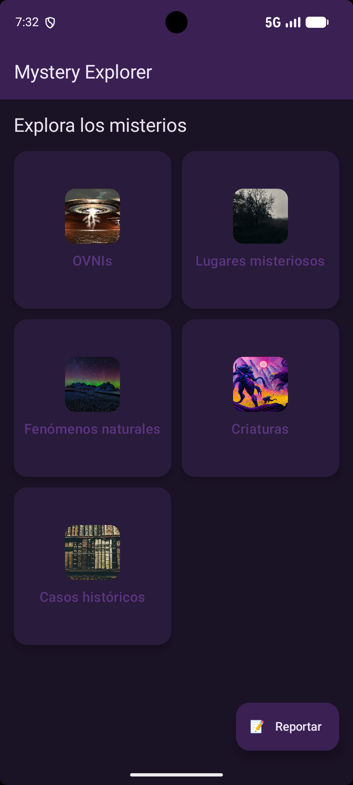
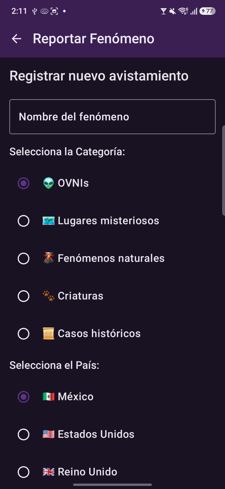
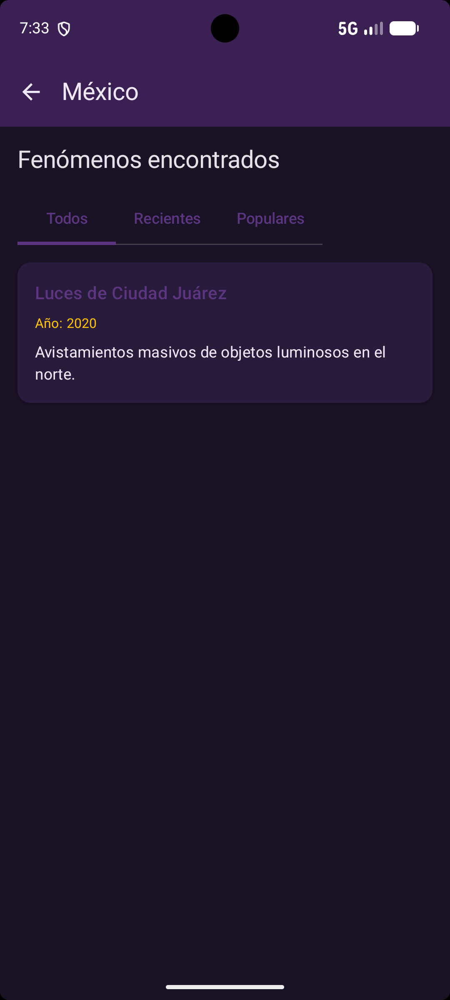
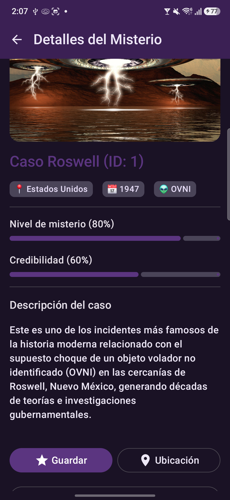

#  Mystery Explorer

Aplicación móvil desarrollada para la exploración de fenómenos extraños en el mundo (OVNs, lugares misteriosos, fenómenos naturales, criaturas y casos históricos), diseñada cumpliendo con los elementos avanzados de interfaces de usuario en múltiples tecnologías.

---

##  1. Datos de Identificación
* **Nombre completo:** Sofía Ortega García
* **Número de boleta:** 2024630517
* **Grupo:** 7CV4
* **Escuela:** ESCOM - IPN (Ingeniería en Sistemas Computacionales)

---

##  2. Tecnologías Utilizadas
La aplicación fue implementada de manera equivalente en tres tecnologías distintas:
1. **Android Jetpack Compose + Kotlin** (Interfaz declarativa moderna).
2. **Android Views + XML + Kotlin** (Interfaz imperativa tradicional).
3. **Flutter + Dart** (Framework multiplataforma).

### Tabla de Equivalencias Tecnológicas

| Componente UI / Tarea | Jetpack Compose | Android Views (XML) | Flutter (Dart) |
| :--- | :--- | :--- | :--- |
| **Contenedor Principal** | `Scaffold` / `Column` | `ConstraintLayout` / `LinearLayout` | `Scaffold` / `Column` |
| **Listas y Colecciones** | `LazyColumn` / `LazyVerticalGrid` | `RecyclerView` / `GridView` | `ListView.builder` / `GridView.builder` |
| **Navegación** | Estado mutable (`sealed class`) | Fragments / Intents | Navigator 2.0 / `Navigator.push` |
| **Entrada de Texto** | `OutlinedTextField` | `EditText` | `TextField` |
| **Selección y Acciones** | `Switch`, `Slider`, `Tabs` | `Switch`, `SeekBar`, `TabLayout` | `Switch`, `Slider`, `TabBar` |

---

##  3. Instrucciones de Compilación y Ejecución

### Versión 1: Jetpack Compose (Kotlin)
1. Abrir la carpeta `android-compose/` en **Android Studio**.
2. Esperar a que Gradle sincronice las dependencias (`build.gradle.kts`).
3. Seleccionar un emulador o dispositivo físico con Android (SDK 24 o superior).
4. Hacer clic en el botón **Run **.

### Versión 2: Android Views + XML (Kotlin)
1. Abrir la carpeta `android-views/` en **Android Studio**.
2. Sincronizar el proyecto con los archivos Gradle.
3. Ejecutar sobre el emulador o dispositivo de prueba mediante el botón **Run**.

### Versión 3: Flutter (Dart)
1. Abrir la carpeta `flutter-app/` en **Android Studio** o **VS Code**.
2. Ejecutar el comando `flutter pub get` en la terminal para descargar paquetes.
3. Conectar un dispositivo o iniciar un emulador.
4. Ejecutar el comando `flutter run` o presionar F5.

##  4. Mapeo de Secciones con capturas de pantalla 

A continuación se detalla en qué pantallas y componentes específicos de la aplicación se implementó cada uno de los requerimientos de la rúbrica:

### 1. Sección 1: Entrada de texto
* **Pantalla:** `ReportScreen.kt` (Pantalla de Reporte de Fenómenos).
* **Implementación:** Se utilizaron componentes `OutlinedTextField` con validaciones visuales de errores para capturar campos de texto como el nombre del fenómeno, correo electrónico, teléfono, número de testigos, contraseña y descripción detallada.
* **Captura de pantalla:** 

### 2. Sección 2: Botones y Acciones
* **Pantalla:** `HomeScreen.kt` (Pantalla de Inicio) y pantallas de navegación.
* **Implementación:** Se integró un Botón de Acción Flotante extendido (`ExtendedFloatingActionButton` con la etiqueta "Reportar") en la esquina inferior y eventos de interacción táctil (`clickable`) en las tarjetas de categoría.
* **Captura de pantalla:** 

### 3. Sección 3: Elementos de selección
* **Pantalla:** `ReportScreen.kt` (Pantalla de Reporte).
* **Implementación:** Se incluyeron botones de opción (`RadioButton`) para elegir estrictamente entre las 5 categorías y países disponibles, un interruptor (`Switch`) para confirmar la veracidad del reporte, y deslizadores (`Slider`) para establecer los niveles de misterio y credibilidad.
* **Captura de pantalla:** 

### 4. Sección 4: Listas y Colecciones
* **Pantalla:** `HomeScreen.kt`, `CountryScreen.kt` y `CasesScreen.kt`.
* **Implementación:** Se empleó el componente de alto rendimiento `LazyColumn` en conjunto con `items` para renderizar de manera dinámica las listas de categorías, los países disponibles y los expedientes filtrados según la selección del usuario.
* **Captura de pantalla:** 

### 5. Sección 5: Información y Retroalimentación
* **Pantalla:** `DetailScreen.kt` y componentes de estado vacío.
* **Implementación:** Se desarrolló la vista detallada que muestra la información completa del caso seleccionado (año, descripción detallada) junto con mensajes informativos y de estado cuando una sección no cuenta con reportes activos.
* **Captura de pantalla:** 

### 6. Sección 6: Contenedores y Estructura
* **Pantalla:** Arquitectura general de la aplicación en todas las vistas.
* **Implementación:** Se estructuró el diseño utilizando contenedores jerárquicos como `Scaffold`, `TopAppBar`, `Surface` y `Card`, unificados bajo el sistema de diseño oscuro y personalizado (`MysteryExplorerTheme`).

##  5. Reflexión Final

* **¿En cuál tecnología resultó más rápido construir la interfaz?**
  * *Jetpack Compose* permitió desarrollar las pantallas con mucha mayor agilidad al no requerir la sincronización constante entre archivos de diseño XML y clases de código lógico.
* **¿Cuál generó código más legible?**
  * *Flutter* y *Jetpack Compose* comparten un paradigma declarativo muy limpio, aunque Jetpack Compose destaca por su integración nativa y fluida con Kotlin.
* **Dificultades encontradas:**
  * En *Android Views*, la gestión de adaptadores para los `RecyclerViews` requirió mayor cantidad de código repetitivo (boilerplate). En *Flutter*, configurar la adaptabilidad exacta del grid adaptativo demandó ajustes adicionales de propiedades de diseño.
* **Tecnología preferida:**
  * *Jetpack Compose*, debido a su potencia, versatilidad y la ventaja directa de trabajar con un ecosistema moderno en Kotlin.

---

## 6. Referencias Consultadas
* Android Developers. (2026). *Jetpack Compose documentation*. Recuperado de https://developer.android.com/compose
* The Flutter Team. (2026). *Flutter UI documentation and widget catalog*. Recuperado de https://docs.flutter.dev/
* Google. (2026). *Material Design 3 Guidelines and Components*. Recuperado de https://m3.material.io/